<!--
  Premium profile banner — dark/light adaptive
  Note: icons inside GitHub  SVGs are not clickable; use the links below.
-->

  <picture>
    <source media="(prefers-color-scheme: dark)" srcset="./dark.svg" />
    <source media="(prefers-color-scheme: light)" srcset="./light.svg" />
    
  </picture>

  
  
  
  
  

# 💫 About Me

🚀 **IT Infrastructure & Operations Specialist** | ☁️ Cloud | 🤖 Automation | 🔒 Security Enthusiast

Driving scalable solutions and operational excellence.

## 💻 Tech Stack

## 📊 GitHub Stats

## 🐦 Latest Tweet

### ✍️ Random Dev Quote

---

